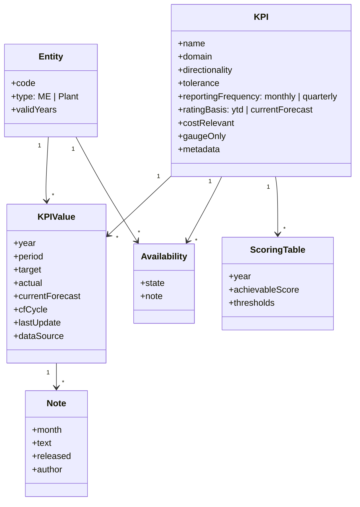

# Project context (steering) — plant performance KPI platform

Persistent steering artifact for the engagement, instantiated from
[`../docs/context-template.md`](../docs/context-template.md). Every agent reads this in every step. It accretes over the
engagement. Spec (required behaviour) lives in [`../requirements/`](../requirements/); this file is stable background
knowledge only.

## Domain glossary

| Term | Definition |
| ---- | ---------- |
| ME | Mobility Electronics — the business-unit total (an aggregate "entity" alongside individual plants). |
| Plant | A production site. Current configurable list: AdP, AnP, BhP, BrgP, CeaP, CljP, HtvP, JuP1, NhP1, PgP1, RBAC, RBEM, RtP2, SzP. |
| KPI | Key performance indicator tracked per entity and year, rated against a target. |
| CF (current forecast) | Forecast cycles produced in Feb/May/Sep/Nov: CF02, CF05, CF09, CF11. |
| YTD actual | Year-to-date actual value of a KPI. |
| Target | Business-plan value a KPI is rated against. |
| Directionality | Whether "higher is better" or "lower is better" for a KPI (FR-005). |
| Vicinity / tolerance | Relative (% of target) or absolute band around target that separates yellow from red (FR-009). |
| Achievable score | Non-negative points a KPI contributes to plant ranking; 0 means disregarded (FR-018). |
| Availability | Per KPI/plant state: true (green), false (red), limited (yellow), invalid (grey) (FR-055). |
| SMT | Surface Mount Technology — an example process a plant may lack, making related KPIs `invalid`. |
| CUV | Capacity Utilization Variance — a gauge KPI (no time series). |
| VA | Value-add — gauge KPI (target gap in million EUR). |
| TNS | Total Net Sales — a cost-relevant (Pareto) KPI. |
| oneIDM | Bosch identity source (formerly OneIdentity); groups batch-synced to Azure and passed in request headers. |

## Roles (derived from group membership, FR-033)

| Role | Capability |
| ---- | ---------- |
| Regular user | Read-only view of KPI data (FR-030). |
| Admin user | Interactive data correction (FR-031); requires login (FR-029). |
| Plant controller | May add/edit/release KPI-month notes (FR-041–044). |
| Super user | May edit per-cell availability notes (FR-061, FR-062). |
| Automation client | Non-interactive programmatic API push (FR-032, Iteration 2). |

## Key entities and domain model

The reference star schema in `requirements/examples/db.xlsx` (current PowerBI backend) guides the concrete tables and
seeds migration data.

## External systems and integrations

| System | Purpose | Interface | Owner |
| ------ | ------- | --------- | ----- |
| Microsoft Entra ID | SSO authentication | OIDC via registered Enterprise app | Bosch IT |
| oneIDM | Source of group membership → roles | Batch sync to Azure; groups in request headers | Bosch IT |
| Data providers | Push KPI data | REST API (FR-028); non-interactive push in Iteration 2 (FR-032) | Data owners |
| Azure (Bosch tenant) | Hosting | Azure Container Apps / App Service | Bosch Cloud |

## Tech and stack constraints

- **Imposed:** Azure hosting (Bosch tenant); Bosch-network-only access (NFR-002); Bosch Frontend Kit 5.1.0 for UI
  (framework-agnostic); Entra ID SSO + oneIDM header-based roles; PowerBI feature-parity gate.
- **Chosen (see ADR-001):** Python + FastAPI backend, PostgreSQL, TypeScript + Vite frontend with the Frontend Kit,
  ECharts for charts.

## Prior decisions

| ADR | Decision | Status |
| --- | -------- | ------ |
| [ADR-001](../docs/decisions/ADR-001-technology-stack.md) | Technology stack | Accepted |

## Non-goals

- Not replacing PowerBI until feature parity is signed off.
- Not building mobile support before Iteration 3 (NFR-004).
- Not authoring KPI data itself — data is pushed in via the API (FR-028).

## Lessons and assumptions log

| Date | Iteration | Assumption / lesson |
| ---- | --------- | ------------------- |
| 2026-07-03 | 1 | Availability data model must exist before ranking (FR-022/FR-056), so R3 precedes R4. |
| 2026-07-03 | 1 | Roles are derived from trusted request headers set by the Entra/oneIDM edge; the app does not perform interactive OIDC itself. |
