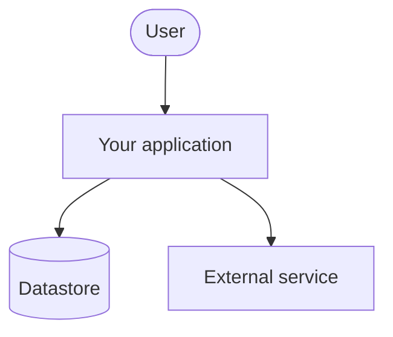
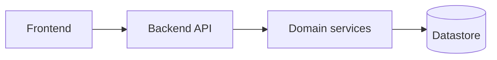
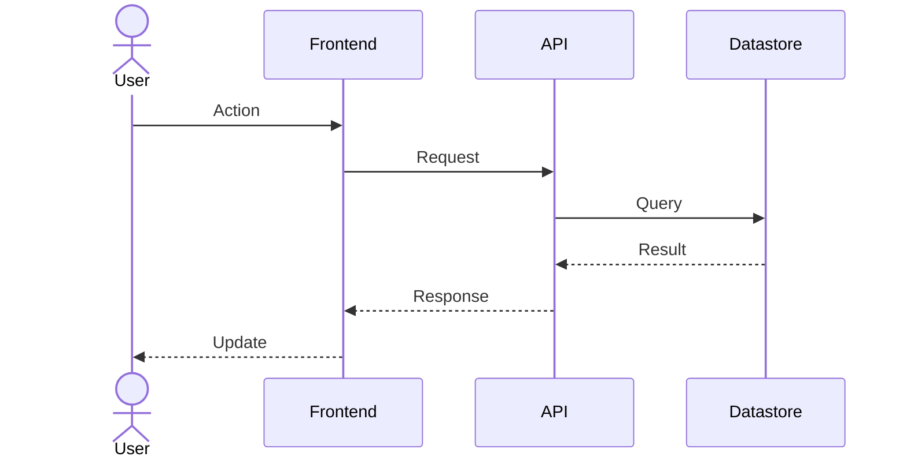

# Architecture

> **Template.** This file is a placeholder for **your project's** architecture, not the architecture of this catalog.
> Replace the example diagrams below with the real structure and runtime flows of the software you are building, and
> keep them updated as the system evolves (see [`../docs/quality-standards.md`](../docs/quality-standards.md)).

Document the architecture with [Mermaid](https://mermaid.js.org/) diagrams so they live as code inside Markdown and stay
version-controlled. A change to the system's structure without a corresponding diagram update is incomplete.

## System context

Replace this with a high-level view of your system, its users, and the external systems it integrates with.

## Components

Replace this with the internal components/modules of your system and their dependencies.

## Runtime flow

Replace this with a key runtime flow (for example a request lifecycle) using a `sequenceDiagram`.

