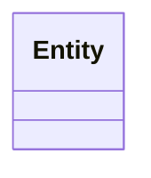

# Project context (steering) — template

This is the **persistent context / steering artifact** for an engagement: the
durable shared memory that every agent reads in every step. Instantiate it **once
per engagement** in the engagement workspace (for example as `00-context.md`),
never in this catalog repository, and let it **accrete** over the life of the
engagement.

## Context vs. spec

Keep these two artifacts distinct (see [`delivery-loop.md`](delivery-loop.md)):

- **Spec** = the **required behaviour**. It changes **per iteration** and is the
  contract for what must be built. Lives in the requirements spec
  ([`../product/requirements-template.md`](../product/requirements-template.md)).
- **Context (this file)** = **stable background knowledge** that helps every agent
  interpret the spec. It is **accreted and rarely reset**. Do not inline domain
  background into the spec — put it here and link to it.

Both the context and the spec are carried into every step of every iteration.

---

## Domain glossary

| Term | Definition |
| --- | --- |
| [term] | [precise, unambiguous definition] |

## Key entities and domain model

Describe the core entities and their relationships. A Mermaid `classDiagram` or
`graph` is preferred so it stays version-controlled.

## External systems and integrations

| System | Purpose | Interface / protocol | Owner |
| --- | --- | --- | --- |
| [system] | [why it is used] | [REST / gRPC / queue / …] | [team or vendor] |

## Tech and stack constraints

- **Languages / frameworks:** [e.g. Python + FastAPI, TypeScript + React]
- **Runtime / platform:** [e.g. Kubernetes, serverless]
- **Imposed constraints:** [regulatory, contractual, or legacy limits]

## Prior decisions

Link to the ADRs that shape this engagement. Do not restate them here — reference
them so the context stays a map, not a copy.

| ADR | Decision | Status |
| --- | --- | --- |
| ADR-NNN | [one line] | Accepted |

## Non-goals

State explicitly what this engagement is **not** trying to do, to keep scope and
context bounded.

- [Not a goal: …]

## Lessons and assumptions log

A running log, appended over iterations. Capture assumptions made and lessons
learned so later iterations do not relearn them.

| Date | Iteration | Assumption / lesson |
| --- | --- | --- |
| YYYY-MM-DD | [n] | [what was assumed or learned] |
