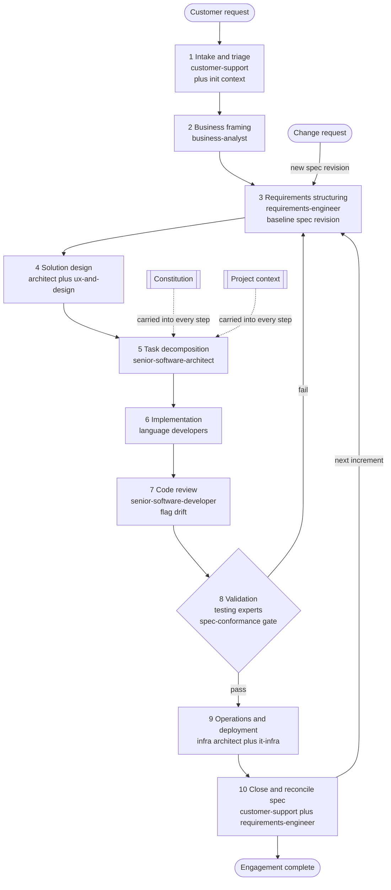

# Delivery loop

This document describes the shared **delivery loop** the agents use to turn a customer request (for example, a customer
requirements document) into a delivered outcome. Every agent references this loop so it understands how the work flows,
what it receives, what it produces, and who it hands off to.

The loop is **iterative and spec-anchored**, not a one-time pass. It runs as a repeatable cycle: each iteration delivers
a **thin, working increment** against a slice of the requirements spec, and the spec stays the **living source of
truth** for the lifetime of the engagement.

## Two persistent layers (carried into every step)

Above any single step or iteration sit two artifacts that **every agent reads in every step**:

- **Constitution** — the invariant rules every agent must honour ([`constitution.md`](constitution.md)).
- **Project context / steering** — durable shared background knowledge ([`context-template.md`](context-template.md)),
  instantiated per engagement as `00-context.md`.

Distinguish the two carried artifacts from the spec:

- **Spec = required behaviour.** Changes **per iteration**; it is the contract for what must be built.
- **Context = stable background knowledge.** Accreted over the engagement, rarely reset.

## How the loop works

The loop chains agents so that each step's output becomes the next step's input. Engage only the steps a given request
actually needs, and iterate within a step before moving on. The whole loop then **repeats per iteration** rather than
terminating.

**Coordinating roles (span the whole loop):** `project-delivery-manager` and `agile-delivery-lead` steer the loop
end-to-end — owning scope, schedule, risk, and flow, and removing blockers between steps. `product-manager` feeds
prioritization into business framing (step 2) and requirements structuring (step 3) so the loop takes on the right work
in the right order.

**Cross-cutting reviewers (engaged where relevant):** `security-engineer` and `compliance-and-data-protection-expert`
review across solution design (step 4), implementation (step 6), and validation (step 8) whenever a request carries
security, personal-data, or regulatory weight.

1. **Intake & triage — `customer-support`** Receives the raw customer request (e.g., requirements document). Produces a
   clean intake summary that flags missing information and classifies the work. Records the current **team version**
   (from [`team-manifest.md`](team-manifest.md)) and **initialises the project context / steering artifact**
   (`00-context.md`) from [`context-template.md`](context-template.md) so it is clear which agent setup is resolving the
   request (see [`versioning.md`](versioning.md)).
2. **Business framing — `business-analyst`** Receives the intake summary and original request. Produces a scope and
   value framing (context, constraints, impact) and **enriches the context artifact** (glossary, stakeholders, domain).
3. **Requirements structuring — `requirements-engineer`** Receives the business framing and original request. Produces a
   structured, testable requirements spec (functional, non-functional, acceptance criteria), authored for human **and
   AI** consumers per [`spec-authoring-guide.md`](spec-authoring-guide.md). This spec is the contract for every
   downstream step. The requirements engineer **owns the spec across iterations**: each iteration baselines a new spec
   revision and reconciles drift.
4. **Solution design — `senior-software-architect` and `ux-and-design-expert`** Receive the requirements spec. Produce a
   technical architecture outline and UX/design notes. For data-driven work, `data-engineer`, `data-analyst`, and
   `database-administrator` shape the data model, datasets, and storage design here.
5. **Task decomposition — `senior-software-architect`** Receives the design and the spec slice for the iteration.
   Produces a small, ordered, independently-verifiable **task list** (from
   [`task-breakdown-template.md`](task-breakdown-template.md)), each task traceable to one or more `FR`/`NFR` IDs. This
   is the per-iteration backlog.
6. **Implementation — language-focused developers** (`software-developer-python`, `-javascript`, `-scripting`, `-ai`,
   `software-developer-mobile`) Receive the **tasks** (not the whole spec at once) and the design. Produce the
   implementation (code and artifacts) for those tasks in the engagement workspace, reinforcing thin increments. For
   data-driven work, `data-engineer` and `database-administrator` build the pipelines, datasets, and storage the
   solution depends on.
7. **Code review — `senior-software-developer`** Receives the implementation. Produces reviewed, cleaned-up code
   following Clean Code principles, and **flags spec drift** — rejecting changes whose behaviour is not reflected in the
   spec or that lack a traceable test.
8. **Validation — testing experts** (`unit-test-expert`, `integration-and-systems-test-expert`,
   `load-and-performance-test-expert`, `user-acceptance-test-expert`) Receive the spec and reviewed code. Produce test
   cases, results, and a release-readiness (go/no-go) assessment across unit, integration/system, performance, and
   acceptance levels. The assessment must clear the **spec-conformance gate** (below).
9. **Operations & deployment — `senior-infrastructure-architect`, `it-infrastructure-expert`, and
   `devops-release-engineer`** Receive the validated solution. Produce environment, deployment, and monitoring plans,
   with `devops-release-engineer` automating the CI/CD and release path. `database-administrator` supports backup and
   recovery planning.
10. **Close the loop & reconcile — `customer-support` and `technical-writer` (with `requirements-engineer`)** Packages
    the result into a customer-facing response and updates the knowledge base, with `technical-writer` producing the
    user docs, API references, and runbooks that accompany the delivered outcome. Before the iteration is done, the spec
    is **reconciled**: any behaviour changed during implementation/review/testing is reflected back into the
    requirements spec so it never drifts behind the code.

After step 10 the loop **iterates again** for the next increment, or the engagement closes if the spec is fully
delivered and verified.

### Spec-conformance gate (in validation)

Release-readiness is **go** only when:

- every `MUST` requirement has a passing acceptance test that references its requirement ID, and
- no requirement is in `Drifted` status.

Otherwise the iteration loops back to the relevant step (requirements, decomposition, or implementation) rather than
shipping.

### Iteration and change-request entry points

- **Loop-back (new increment):** after closing an iteration, re-enter at **step 3 (requirements structuring)** to
  baseline the next spec revision and slice.
- **Change request:** new or changed customer needs re-enter at **step 3** and carry a **new spec revision** — never an
  ad-hoc code edit. Spec-first, then code.

## Passing data between steps

- **Chain the artifacts:** keep each step's output as a separate file (for example `01-intake.md`,
  `02-business-framing.md`, `03-requirements.md`, `05-tasks.md`, …).
- **Carry the two persistent layers into every step:** the **constitution** ([`constitution.md`](constitution.md)) and
  the **project context** (`00-context.md`) are standing inputs to **every** numbered step, just like the spec.
- **Always carry the requirements spec (step 3)** as context into later steps so every agent works against the same
  contract.
- **Keep the spec authoritative:** behaviour changes update the spec **first, then code**. Reconcile drift at step 10
  before closing an iteration.
- **Record the team version** (from [`team-manifest.md`](team-manifest.md)) at intake and keep it with the engagement's
  outputs, so the agent setup that resolved the request stays traceable. If the team is updated mid-engagement, record
  the new team version at the point it is adopted. See [`versioning.md`](versioning.md).
- **Iterate** within a step (for example, re-run a developer after a review finding) before advancing, and **iterate the
  whole loop** per increment.
- **Keep handoffs minimal, exact, and clear.** Follow the [communication standard](communication-standard.md): a wordy
  human request must become lean agent-to-agent messages and self-explanatory code, to keep token use low and meaning
  unambiguous.

## Supporting roles (engage as needed)

- `engineering-manager` — engineering capacity, staffing, and cross-team coordination behind steps 5–6.

## Keep output out of this repository

This repository is a **catalog of agent prompts**, not a workspace. When running the loop:

- Do all generation in a **separate engagement workspace** (its own folder, runtime project, or Git repository), never
  inside this catalog repo.
- Treat this repo as read-only: you only **copy agent prompts and templates out of it**.
- Never commit customer documents or generated output back into this repository.
