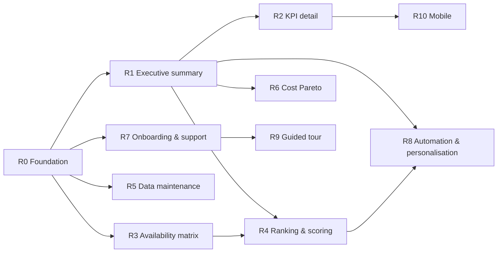

# Product roadmap & delivery plan

Owner: **product-manager**. This roadmap sequences the captured spec ([user-journeys](user-journeys.md),
[user-stories](user-stories.md), [functional-requirements](functional-requirements.md),
[non-functional-requirements](non-functional-requirements.md)) into an ordered set of **thin, working releases** that
the agentic delivery loop ([`../docs/delivery-loop.md`](../docs/delivery-loop.md)) resolves one at a time.

It decides **what** is built, **why**, and **in what order** — not how. Architecture and task decomposition stay with
the architect (delivery-loop steps 4–5). Team version at kickoff: **3.0.0** (see
[`../docs/team-manifest.md`](../docs/team-manifest.md)).

## Sequencing principles

- **Value first, dependencies respected.** The executive summary is the landing view and the highest-value slice, so it
  leads. Downstream views build on the data model and auth it establishes.
- **Feature-parity gate.** Iteration 1 delivers the `MUST` set that reaches parity with the existing PowerBI app (the
  replacement gate, see non-functional Constraints). Only then may the PowerBI app be retired.
- **Thin vertical slices.** Each release cuts through database → backend → frontend for a coherent user outcome, not a
  horizontal layer, so every release is demoable and testable against its acceptance criteria.
- **Spec-anchored.** Every release closes only through the spec-conformance gate: each `MUST` has a passing acceptance
  test that references its `FR`/`NFR` id, and no requirement is left `Drifted`.

## Release plan

Iteration numbers below match the `Iteration` column already set in the spec. Iteration 1 is delivered as an ordered
series of releases (R0–R7); Iterations 2–3 carry the deferred `SHOULD`/`COULD` work.

| Release | Theme / outcome | Journeys | Stories | Requirements | Iter. | Priority |
| ------- | --------------- | -------- | ------- | ------------ | ----- | -------- |
| **R0** | Foundation: runnable shell, Bosch-branded, deploy pipeline, auth wiring, data model seeded from `db.xlsx` | — (enabler) | — | NFR-001, NFR-002, NFR-003, NFR-005; FR-028, FR-029, FR-030, FR-033 | 1 | MUST |
| **R1** | Executive summary: at-a-glance active-KPI status with entity & year scope | UJ-001 | US-001, US-002, US-003 | FR-001–017 | 1 | MUST |
| **R2** | KPI detail & context: trends, status, benchmark, sources, metadata, notes, gauge | UJ-004 | US-010–016, US-019 | FR-034–046, FR-051–053 | 1 | MUST |
| **R3** | Availability matrix: per-plant KPI availability + per-cell super-user notes | UJ-006 | US-020, US-024 | FR-054, FR-055, FR-061, FR-062 | 1 | MUST |
| **R4** | Plant ranking & scoring: score, rank, colour, year-versioned scoring table | UJ-002 | US-004–007 | FR-018–027, FR-056 | 1 | MUST |
| **R5** | Data maintenance: interactive admin edits (read-only for others) | UJ-003 | US-008 | FR-031 (+ FR-029, FR-030, FR-033 from R0) | 1 | MUST |
| **R6** | Cost Pareto view of cost-relevant KPIs across plants | UJ-005 | US-018 | FR-049, FR-050 | 1 | MUST |
| **R7** | Onboarding & support: release notes and About page | UJ-007 | US-021, US-023 | FR-057, FR-060 | 1 | SHOULD |
| **R8** | Automation & personalisation: non-interactive API push, custom KPI views | UJ-003, UJ-001 | US-009, US-017 | FR-032, FR-047, FR-048 | 2 | SHOULD |
| **R9** | Guided first-use tour | UJ-007 | US-022 | FR-058, FR-059 | 2 | SHOULD |
| **R10** | Mobile access | — | — | NFR-004 | 3 | COULD |

Rationale for order: **R3 precedes R4** because availability state drives scoring (FR-022, FR-056); the ranking cannot
be verified without the availability data model in place. R5 (maintenance) and R6 (cost) follow the core read views. R7
onboarding is a low-risk `SHOULD` that ships inside Iteration 1 because its `FR`s are tagged Iteration 1.

## Dependencies

## How each release runs through the delivery loop

Every release is one turn of the loop. The coordinating roles (`project-delivery-manager`, `agile-delivery-lead`) steer
flow end-to-end; `product-manager` (this owner) feeds prioritization into steps 2–3; `security-engineer` and
`compliance-and-data-protection-expert` review R0, R5, and R8 (auth, data modification, external push).

| Loop step | Agent(s) | Output per release |
| --------- | -------- | ------------------ |
| 1 Intake & triage | customer-support | intake summary, init `00-context.md`, record team version |
| 2 Business framing | business-analyst | value/scope framing, enrich context |
| 3 Requirements structuring | requirements-engineer | baseline the release's spec slice (already captured here) |
| 4 Solution design | senior-software-architect, ux-and-design-expert, data-engineer, data-analyst, database-administrator | architecture outline, UX notes, data model |
| 5 Task decomposition | senior-software-architect | ordered task list traceable to FR/NFR ids |
| 6 Implementation | software-developer-python / -javascript, data-engineer, database-administrator | code + artifacts for the slice |
| 7 Code review | senior-software-developer | reviewed code, drift flags |
| 8 Validation | unit-, integration-and-systems-, load-and-performance-, user-acceptance-test-expert | tests + go/no-go against the spec-conformance gate |
| 9 Operations & deployment | senior-infrastructure-architect, it-infrastructure-expert, devops-release-engineer | environment, deploy, monitoring, CI/CD |
| 10 Close & reconcile | customer-support, technical-writer, requirements-engineer | user docs, spec status reconciled (Specified → Verified) |

## Exit gate per release (spec-conformance)

A release is **done** only when, for every requirement in its slice:

- the `Spec status` is moved `Specified → Implemented → Verified` in the spec files, and
- every `MUST` requirement has a passing acceptance test that cites its `FR`/`NFR` id, and
- no requirement is left `Drifted`.

Otherwise the release loops back to requirements, decomposition, or implementation rather than shipping (see the
spec-conformance gate in [`../docs/delivery-loop.md`](../docs/delivery-loop.md)).

## Success measures

- **Iteration 1 (R0–R7):** feature parity with the PowerBI baseline reached and signed off, so the PowerBI app can be
  retired; every `MUST` requirement `Verified`.
- **Per release:** its user journey is demoable end-to-end on a supported desktop browser within the NFR-005 response
  budget (≤ 1 s p95 normal load, ≤ 3 s heavy).
- **Quality:** unit coverage ≥ 80 %, every user-facing behaviour covered by a Given-When-Then acceptance test traceable
  to a requirement (see [`../docs/quality-standards.md`](../docs/quality-standards.md)).
